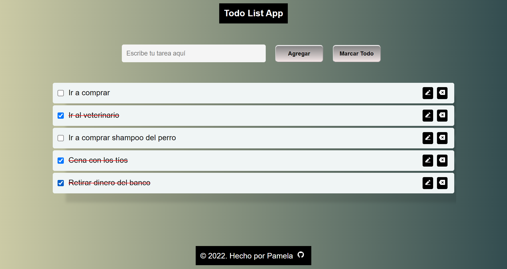
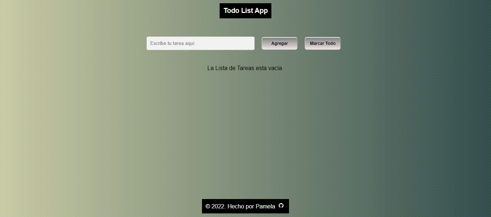
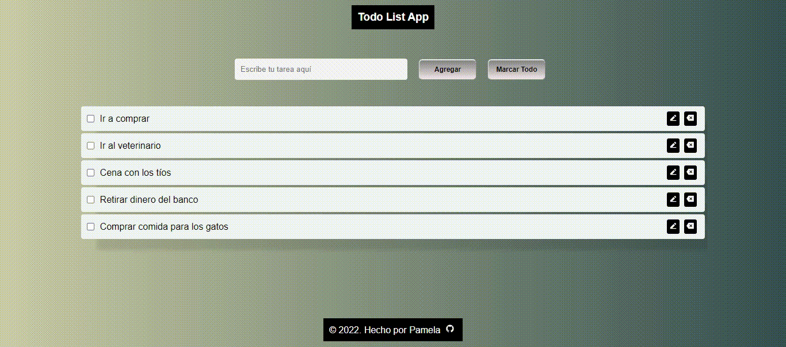
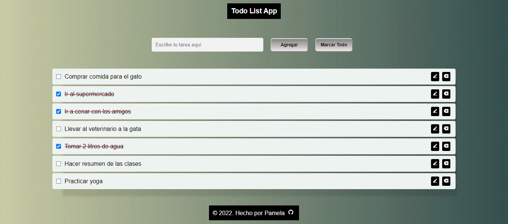

# To do List


To do list realizado con Vue.

- [Demo](to-do-list-vue-pam.netlify.app)
- [Código](to-do-list-vue-pam.netlify.app)



## Funcionalidad


- [X] Se puede publicar la tarea.
- [X] Se puede editar la tarea.



- [X] Se puede marcar la tarea realizada.
- [X] Cuenta con boton que marca todas las tareas.



- [X] Se eliminar una tarea individual
- [X] Aparece un mensaje de lista vacía.



- [X] Cuando hay varias tareas aparece un scroll

.gif)


## Project Setup

```sh
npm install
```

### Compile and Hot-Reload for Development

```sh
npm run dev
```

### Compile and Minify for Production

```sh
npm run build
```

### Lint with [ESLint](https://eslint.org/)

```sh
npm run lint
```
